# Diagrama Entidad-Relación - Sistema de Asistencia

## Diagrama Completo

```mermaid
erDiagram
    %% ==========================================
    %% ENTIDADES PRINCIPALES
    %% ==========================================
    
    organizations {
        bigint id PK
        string name
        string ruc "RUC o identificación fiscal"
        string business_name "Razón social"
        text description
        string address
        string phone
        string email
        string legal_rep_id "Cédula representante legal"
        string legal_rep_name "Nombre representante legal"
        timestamp created_at
        timestamp updated_at
    }

    users {
        bigint id PK
        string name
        string email UK
        timestamp email_verified_at
        string password
        enum role "admin|coordinator|user"
        bigint organization_id FK "nullable"
        json face_embedding "Embedding facial para reconocimiento"
        string face_image_path
        boolean consent_face_processing
        string remember_token
        timestamp created_at
        timestamp updated_at
    }

    categories {
        bigint id PK
        string name
        string slug UK
        text description
        boolean is_active
        timestamp created_at
        timestamp updated_at
    }

    events {
        bigint id PK
        bigint organization_id FK "nullable"
        bigint category_id FK "nullable"
        string title
        text description
        string short_description
        enum event_type "presencial|virtual|hibrido"
        string contact_email
        string contact_phone
        datetime start_date
        datetime end_date
        datetime registration_start
        datetime registration_deadline
        datetime early_bird_deadline
        boolean is_free
        decimal price
        string currency "USD por defecto"
        decimal early_bird_price
        decimal group_price
        integer max_group_size
        boolean provides_certificate
        string certificate_type
        integer certificate_hours
        integer min_attendance_percentage "80 por defecto"
        enum location_type "presencial|virtual|hibrido"
        text physical_address
        string room_number
        string virtual_platform
        string virtual_link
        string virtual_password
        integer capacity
        boolean waitlist_enabled
        integer max_waitlist
        boolean requires_approval
        enum status "borrador|publicado|cancelado|completado"
        boolean is_public
        boolean is_open_enrollment "Inscripción abierta"
        boolean featured
        datetime published_at
        text cancellation_policy
        text refund_policy
        text terms_conditions
        string featured_image
        string brochure_file
        string qr_code_path "Ruta imagen QR (legacy)"
        string barcode_code UK "Código barras (legacy)"
        string qr_code UK "UUID único del evento"
        string barcode UK "Código barras corto"
        boolean has_sessions "Tiene múltiples sesiones"
        float face_threshold "Umbral reconocimiento facial"
        boolean allow_face_checkin
        timestamp created_at
        timestamp updated_at
    }

    event_sessions {
        bigint id PK
        bigint event_id FK
        string name "Ej: Sesión Mañana"
        date date
        time start_time
        time end_time
        boolean is_break "Es descanso/almuerzo"
        boolean requires_attendance
        integer order
        text description
        timestamp created_at
        timestamp updated_at
    }

    event_user {
        bigint id PK
        bigint event_id FK
        bigint user_id FK
        string qr_code UK "UUID único por inscripción"
        string barcode UK "E0001U0001XXXX"
        enum code_status "active|used|revoked"
        timestamp code_used_at
        integer scan_count
        timestamp assigned_at
        timestamp created_at
        timestamp updated_at
    }

    attendances {
        bigint id PK
        bigint event_id FK
        bigint event_session_id FK "nullable"
        bigint user_id FK
        datetime check_in_at
        timestamp check_out_at "nullable"
        enum check_type "in|out|both"
        integer duration_minutes "nullable"
        enum method "manual|qr|barcode|face_recognition"
        enum status "present|absent|justified"
        json metadata "device, IP, confidence, etc"
        timestamp created_at
        timestamp updated_at
    }

    %% ==========================================
    %% TABLAS DE SISTEMA (Laravel)
    %% ==========================================

    password_reset_tokens {
        string email PK
        string token
        timestamp created_at
    }

    sessions {
        string id PK
        bigint user_id FK "nullable"
        string ip_address
        text user_agent
        longtext payload
        integer last_activity
    }

    cache {
        string key PK
        mediumtext value
        integer expiration
    }

    cache_locks {
        string key PK
        string owner
        integer expiration
    }

    jobs {
        bigint id PK
        string queue
        longtext payload
        tinyint attempts
        integer reserved_at
        integer available_at
        integer created_at
    }

    job_batches {
        string id PK
        string name
        integer total_jobs
        integer pending_jobs
        integer failed_jobs
        text failed_job_ids
        mediumtext options
        integer cancelled_at
        integer created_at
        integer finished_at
    }

    failed_jobs {
        bigint id PK
        string uuid UK
        text connection
        text queue
        longtext payload
        longtext exception
        timestamp failed_at
    }

    %% ==========================================
    %% RELACIONES
    %% ==========================================

    organizations ||--o{ users : "tiene"
    organizations ||--o{ events : "organiza"
    
    categories ||--o{ events : "clasifica"
    
    users ||--o{ event_user : "se inscribe"
    users ||--o{ attendances : "registra asistencia"
    users ||--o| sessions : "tiene sesión"
    
    events ||--o{ event_user : "tiene inscritos"
    events ||--o{ event_sessions : "tiene sesiones"
    events ||--o{ attendances : "tiene asistencias"
    
    event_user }o--|| events : "pertenece a"
    event_user }o--|| users : "pertenece a"
    
    event_sessions ||--o{ attendances : "registra"
    event_sessions }o--|| events : "pertenece a"
    
    attendances }o--|| events : "del evento"
    attendances }o--|| users : "del usuario"
    attendances }o--o| event_sessions : "de la sesión"
```



## Descripción de Entidades

### 1. **organizations** (Organizaciones)
Empresas o instituciones que organizan eventos.

| Campo | Descripción |
|-------|-------------|
| `ruc` | Identificación fiscal |
| `business_name` | Razón social oficial |
| `legal_rep_*` | Datos del representante legal |

### 2. **users** (Usuarios)
Participantes, coordinadores y administradores del sistema.

| Campo | Descripción |
|-------|-------------|
| `role` | `admin`, `coordinator`, `user` |
| `organization_id` | Organización a la que pertenece (opcional) |
| `face_embedding` | Vector de características faciales para reconocimiento |
| `consent_face_processing` | Consentimiento GDPR para procesamiento facial |

### 3. **categories** (Categorías)
Clasificación de eventos (Conferencia, Taller, Seminario, etc.).

### 4. **events** (Eventos)
Entidad central del sistema con soporte para múltiples escenarios.

| Grupo | Campos |
|-------|--------|
| **Básico** | `title`, `description`, `event_type` |
| **Fechas** | `start_date`, `end_date`, `registration_*` |
| **Precios** | `is_free`, `price`, `early_bird_*`, `group_*` |
| **Certificación** | `provides_certificate`, `certificate_hours`, `min_attendance_percentage` |
| **Ubicación** | `location_type`, `physical_address`, `virtual_*` |
| **Capacidad** | `capacity`, `waitlist_*`, `requires_approval` |
| **Códigos** | `qr_code`, `barcode` (del evento) |
| **Sesiones** | `has_sessions` |

### 5. **event_sessions** (Sesiones de Evento)
Para eventos de larga duración con múltiples bloques.

| Campo | Descripción |
|-------|-------------|
| `is_break` | Si es un descanso (almuerzo, receso) |
| `requires_attendance` | Si requiere registro de asistencia |
| `order` | Orden cronológico |

### 6. **event_user** (Inscripciones) ⭐
**Tabla pivote con códigos únicos por participante.**

| Campo | Descripción |
|-------|-------------|
| `qr_code` | UUID único para este usuario en este evento |
| `barcode` | Código corto `E0001U0001XXXX` |
| `code_status` | `active`, `used`, `revoked` |
| `scan_count` | Intentos de escaneo (detecta fraude) |

### 7. **attendances** (Asistencias)
Registro de check-in/check-out por sesión.

| Campo | Descripción |
|-------|-------------|
| `event_session_id` | Sesión específica (nullable) |
| `check_in_at` | Hora de entrada |
| `check_out_at` | Hora de salida |
| `check_type` | `in`, `out`, `both` |
| `duration_minutes` | Duración calculada |
| `method` | `manual`, `qr`, `barcode`, `face_recognition` |
| `metadata` | JSON con device, IP, confidence, etc. |

---

## Relaciones Clave

### Inscripciones y Códigos Únicos

```
Usuario ──┬── event_user ──┬── Evento
          │   (inscripción)│
          │                │
          │  qr_code: UUID │
          │  barcode: E0001U0001XXXX
          │  code_status: active|used|revoked
          │                │
          └────────────────┘
```

**Cada inscripción tiene códigos únicos que:**
- No pueden ser reutilizados
- Se vinculan a un usuario específico
- Pueden ser revocados si es necesario

### Eventos con Sesiones

```
Evento (12 horas)
├── Sesión 1: 08:00-10:00 (requires_attendance: true)
├── Sesión 2: 10:00-10:30 (is_break: true, requires_attendance: false)
├── Sesión 3: 10:30-12:30 (requires_attendance: true)
├── Sesión 4: 12:30-14:00 (is_break: true - Almuerzo)
├── Sesión 5: 14:00-16:00 (requires_attendance: true)
└── Sesión 6: 16:00-20:00 (requires_attendance: true)
```

### Flujo de Asistencia

```
1. Usuario se inscribe → Se genera qr_code y barcode únicos
2. Usuario escanea código → Sistema busca en event_user
3. Verifica code_status = 'active'
4. Crea registro en attendances
5. Marca code_status = 'used' (o mantiene active si has_sessions)
```

---

## Cardinalidades

| Relación | Cardinalidad | Descripción |
|----------|--------------|-------------|
| Organization → Users | 1:N | Una organización tiene muchos usuarios |
| Organization → Events | 1:N | Una organización organiza muchos eventos |
| Category → Events | 1:N | Una categoría tiene muchos eventos |
| Event → EventSessions | 1:N | Un evento tiene muchas sesiones |
| Event ↔ Users | N:M | Muchos usuarios en muchos eventos (via event_user) |
| Event → Attendances | 1:N | Un evento tiene muchos registros de asistencia |
| User → Attendances | 1:N | Un usuario tiene muchos registros de asistencia |
| EventSession → Attendances | 1:N | Una sesión tiene muchos registros |

---

## Índices y Restricciones

### Claves Únicas (UK)
- `users.email`
- `categories.slug`
- `events.barcode_code`
- `events.qr_code`
- `events.barcode`
- `event_user.qr_code`
- `event_user.barcode`
- `event_user.(event_id, user_id)` - Compuesto

### Claves Foráneas (FK)
- `users.organization_id` → `organizations.id` (nullable, ON DELETE SET NULL)
- `events.organization_id` → `organizations.id` (nullable, ON DELETE SET NULL)
- `events.category_id` → `categories.id` (nullable, ON DELETE SET NULL)
- `event_user.event_id` → `events.id` (ON DELETE CASCADE)
- `event_user.user_id` → `users.id` (ON DELETE CASCADE)
- `event_sessions.event_id` → `events.id` (ON DELETE CASCADE)
- `attendances.event_id` → `events.id` (ON DELETE CASCADE)
- `attendances.user_id` → `users.id` (ON DELETE CASCADE)
- `attendances.event_session_id` → `event_sessions.id` (nullable, ON DELETE SET NULL)

